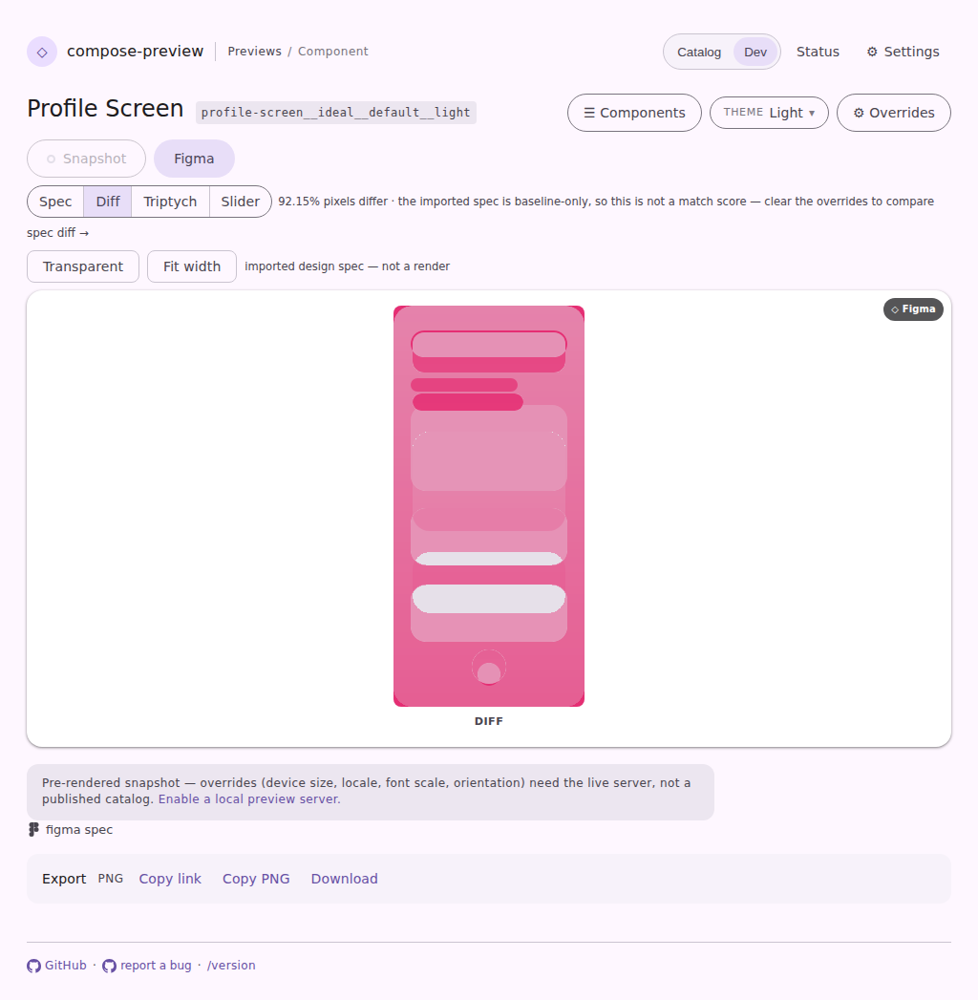
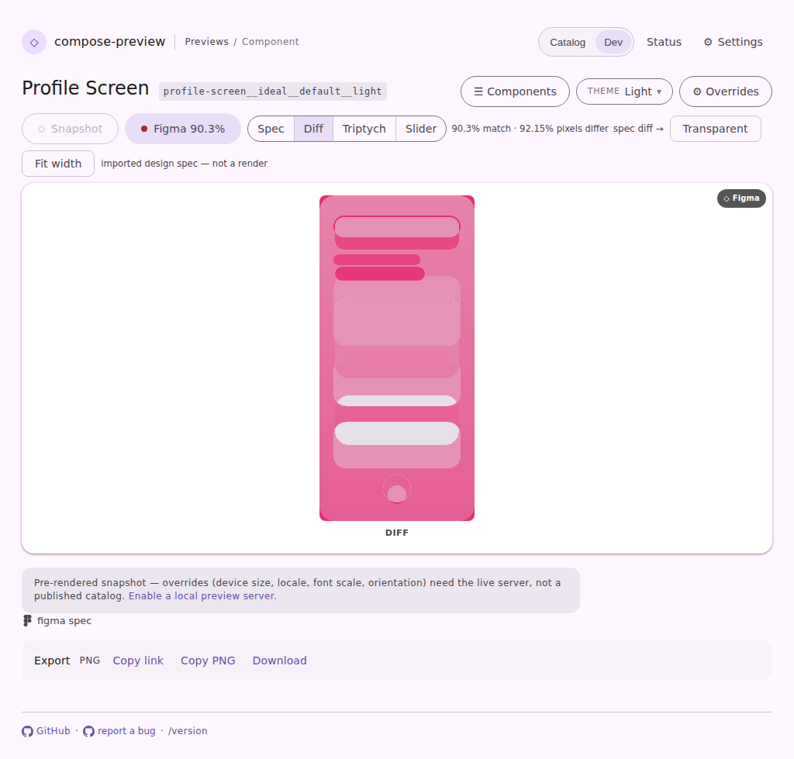

# A default value in the URL stops suppressing the Figma comparison

Committed evidence for #4218, captured from the new
`serve-viewer-spec-default-theme` page fixture through the existing
`pages-snapshot` harness — same runner, same stubs, no design tool contacted.

The fixture is navigated at the reported URL shape:

```
…/p/profile-screen__ideal__default__light?uiMode=light&mode=spec&specView=diff
```

Every part of that is load-bearing. The preview id names its theme, so
`uiMode=light` spells out the value the page would have shown anyway; `mode=spec`
opens the design-spec lane and `specView=diff` picks the comparison. It is the
state a visitor reaches by clicking Dark and then Light again — the toggle
writes `uiMode` on the way through and leaves it behind.

| before | after |
| --- | --- |
|  |  |

Read the chip and the readout; the delta map either side of them is the same
picture, which is the point.

- **before** — chip: `Figma`, readout: `92.15% pixels differ · the imported spec
  is baseline-only, so this is not a match score — clear the overrides to
  compare`. There are no overrides to clear: the only parameter present names
  the default.
- **after** — chip: `Figma 90.3%`, readout: `90.3% match · 92.15% pixels
  differ`. The published verdict is replaced by the live one, measured against
  the frame actually on the stage, exactly as it is for a visitor who never
  touched the toggle.

The two numbers answer different questions and are printed together on purpose:
a high structural match with most pixels differing is a uniform shift.

A genuinely pinned theme still gets the "baseline-only" line — that behaviour is
correct and unchanged, because the imported spec is exported once and not
re-exported per theme. What changed is only which values count as pinning one.

The fixture is registered with the harness, so the pair above is diffed by the
CI visual-diff bot on every subsequent PR without anyone remembering to ask.

```
cd cli/serve-web && npm run typecheck && npm test    # 853 passing
./gradlew :cli:test ktfmtCheck                       # 2,579 tests
cd vscode-extension
npx playwright test -c preview-harness/playwright.config.mjs pages-snapshot
# 138 passed
```
