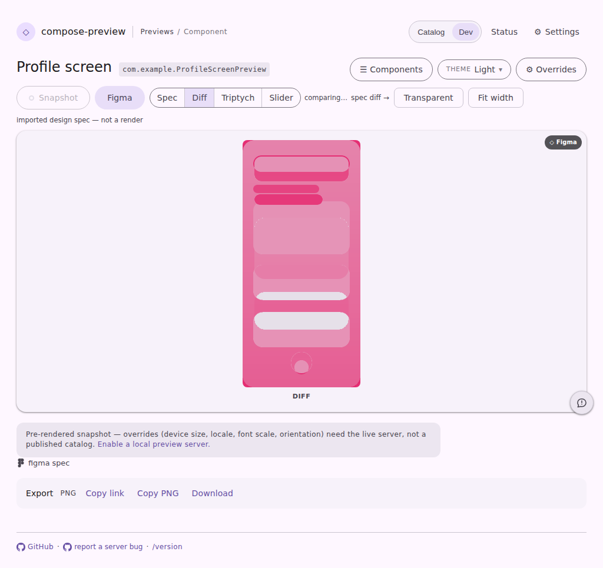
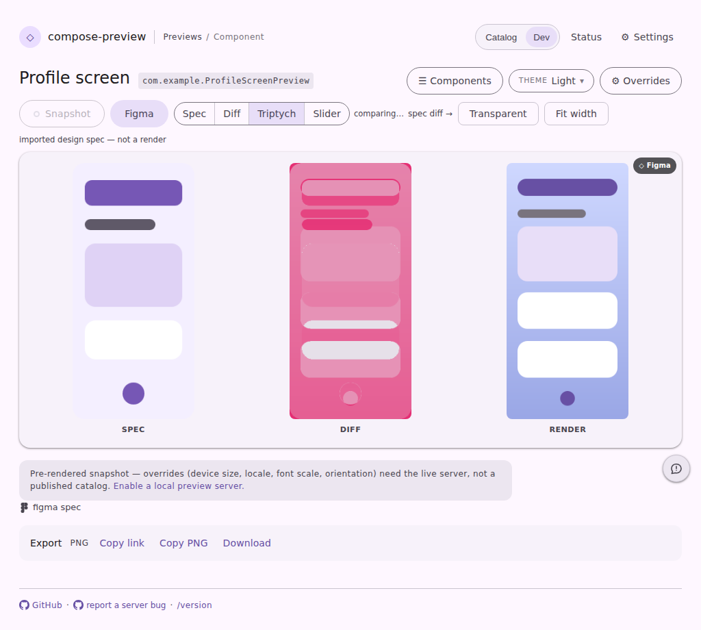

# Entering the design-spec lane lands on the triptych

Committed evidence for #4376, captured from the existing `serve-viewer-path`
page fixture through the `pages-snapshot` harness — same runner, same stubs, no
design tool and no daemon contacted.

Both shots are the harness's `spec-lane` state: the page is entered exactly the
way a visitor enters it, by clicking the `Figma` chip on the viewer bar. Nothing
else is driven — no view button is pressed — so what the stage shows is whatever
the lane decides to open on.

| before | after |
| --- | --- |
|  |  |

- **before** — the chip forced `Diff` on entry, so the stage is the delta map by
  itself and `Diff` is the pressed button. The lane's own default was `Spec`
  (the imported reference alone), which is why the chip had a workaround at all:
  the chip states the divergence, and the plain reference does not answer where
  it is.
- **after** — the lane's default is the triptych, so the stage is Spec / Diff /
  Render in one row and `Triptych` is the pressed button. The delta map is still
  there, in the middle, with the two frames it was taken from either side of it,
  and the chip no longer overrides anything.

The dark pair (`before.dark.png` / `after.dark.png`) is the same state on the
dark catalog.

The fixture is already registered with the harness, so this state is diffed by
the CI visual-diff bot on every subsequent PR without anyone remembering to ask.

```
cd cli/serve-web && npm run typecheck && npm test     # 953 passing
UPDATE_SERVE_WEB_FIXTURES=true ./gradlew :cli:test --tests '*ServeWebFixtureTest*'
./gradlew :cli:test --tests '*ServeWeb*' --tests '*ServeBugReport*' ktfmtCheckAll
cd vscode-extension
HARNESS_FIXTURE=serve-viewer-path npx playwright test \
  -c preview-harness/playwright.config.mjs pages-snapshot.spec.mjs --grep 'snapshot ·'
```
